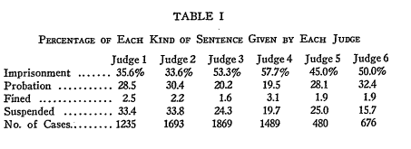

% Judicial methods masterclass
% Chris Hanretty
% May 2016

```{r setopts, echo = FALSE}
library(knitr)
opts_chunk$set(echo = FALSE, results = "hide",
               message = FALSE, warning = FALSE)
round2 <- function(x)round(x, digits = 2)
```

# Introduction
	
## About myself

I'll begin by saying something about myself.
I'm a Reader in Politics at the University of East Anglia.
I do research on two main areas: political representation, and judicial behaviour.
I've previously published on judicial behaviour in the UK and in continental Europe.

I am *not* a lawyer.
I've not done a degree in law.
I've had to learn about the law, but I've done so in an unstructured way.
And so, many of the things that I say may be legally naïve.
Of course, that may be because the models I describe are legally naïve.

## About you

That's me.
What about you?

I'm going to assume that you are all lawyers who are interested in empirical methods.
But I'm not going to assume that you have any knowledge of statistics.

I don't know whether you want to use empirical methods, or consume empirical methods.
But I'll teach you how I would use these methods of analysis.
That way I hope you'll get a better understanding of how to interpret these kinds of methods when you encounter them.

Some of you, of course, may already have a good knowledge of statistics.
You may find the first part of this masterclass a little too basic.
I can only apologise, and hope that you find certain parts to be a useful refresher.

## About the course

The first half of this course deals with decision-making by individual judges.
I'll look first at the simple case where a judge has to make a continuous decision.
That will be our way of looking at simple linear regression.

I'll then move on to the case where a judge has to make a binary decision.
That allows us to look at logistic regression.
Logistic regression will then stay with us throughout the course.

I'll then progressively introduce certain complications.
These complications will result from introducing multiple judges, and from introducing situations where judges are not randomly assigned to cases.

That first half of the course will be looking at variation across cases.
But there's another kind of variation that's interesting.
That's variation within a single case, which arises because judges disagree.
And so in the second half of the course I'll look at methods for the analysis of dissent.

In particular, I'll look at what are called item response models.
Like logistic regression models, we're trying to explain a binary outcome.
Either the judge did or didn't dissent.
But these models are more complicated than logistic regression models.
The meaning of dissent changes over cases.
Sometimes dissent might be "liberal".
Sometimes dissent might be "conservative".
Item response models help us to figure out which it is, by looking at the patterns of dissent.

As I go, I'll try to give published examples which have used these techniques.
I'll also try to provide code that will replicate these results.
I use statistics software called R.
Many of the things that we do in the first half of the course can be done in any statistics package.
They can be done in SPSS, or Stata, or even Excel if you're masochistic enough.
But many of the things we do in the second half of the course can best be done in R.

# Random assignment, single judge, continuous outcome

I'm going to start with the simplest possible example. 
That's the case where

 - a single judge is randomly assigned to a case, and
 - must make a continuous, numeric, decision.

There are two common situations where judges must make continuous numeric decisions.
The first is when judges make financial awards for damages. 
In this case, the decision is the amount of money, whether that's one, ten, or a hundred thousand euros. 
The second situation is when judges send people to prison. 
In this case, the decision is the length of the criminal sentence, whether that's ten, a hundred, or a thousand days. 

I start with these continuous decisions because they're easy to model. 
Specifically, we can model them using linear regression. 
The intuition behind linear regression is easy to understand. 
You see it every time you see a scatter-plot. 

Here's a very famous scatter-plot. 
It comes from the 19th century sociologist Francis Galton. 
On the horizontal axis, we have the height of parents. 
On the vertical axis, we have the height of children. 

```{r galton, fig = TRUE, fig.cap = "Galton's height data"}
galton <- read.csv("Galton.csv")

plot(galton$Father, galton$Height,
     xlab = "Child's height [inches]",
     ylab = "Father's height [inches]",
     pch = 19,
          col = 'darkgrey')

```

You can see there's a relationship there. 
The taller the parents, the taller the children, on average. 

```{r galton2, fig = TRUE, fig.cap = "Galton's height data"}
mod <- lm(Height ~ Father, data = galton)
plot(galton$Father, galton$Height,
     xlab = "Child's height [inches]",
     ylab = "Father's height [inches]",
     pch = 19,
          col = 'darkgrey')

abline(mod)

text(65, 77,
     label = "y = a + bx", pos = 1)
```

```{r galton3, fig = TRUE, fig.cap = "Galton's height data"}

plot(galton$Father, galton$Height,
     xlab = "Child's height [inches]",
     ylab = "Father's height [inches]",
     pch = 19,
          col = 'darkgrey')

abline(mod)

text(65, 77,
     label = paste0("y = ",
         round2(coef(mod)[1]),
         " + ",
         round2(coef(mod)[2]),
         " * x"),
     pos = 1)
```

We can summarize that relationship using an equation. 
That's the equation for the straight line: $y = a + bx$. 
I'm going to refer to the $a$ as the intercept, and $b$ as a coefficient. 

There are lots of different possible values for a and b. 
But the best-fitting values are here: $a = `r round2(coef(mod)[1])`$ and $b = `r round2(coef(mod)[2])`$. 
What does that $b$ mean? 

It means that for every extra inch in parental height, child height goes up by `r round2(coef(mod)[2])`. 
Formally: for every single unit change in x, the dependent variable changes by b. 

How can we use that to examine the impact of judges? 
This equation is a way of connecting two numbers -- but judges aren't numbers. 

Well, we can turn judges into numbers. 
Let's imagine a situation with two judges: Judge Soft and Judge Hard. 
And suppose Judges Soft and Hard take the following decisions in sentencing. 

I'm going to create what's known as dummy variable. 
That's a variable which has a value either of zero or a value of one. 
That dummy variable is going to have a value of one when judge Hard decides a case. 
It'll have a value of zero when judge Soft decides a case. 
To use another term of art: that means that judge Soft is our "reference level", or "reference category".

```{r fakedata}
set.seed(160506)
nCases <- 500
dat <- data.frame(Judge = rep(c("Hard","Soft"),
                      times = nCases))
dat$Sentence <- rnorm(n = nCases,
                      mean = 10 + as.numeric(dat$Judge == "Hard") * 2,
                      sd = 3)
dat$JudgeHard <- as.numeric(dat$Judge == "Hard")
write.csv(dat, file = "fakedata.csv")
```

We can the create another graph. 
Here we have the value of the dummy variable on the horizontal axis. 
We have the length of the sentence on the vertical axis. 

```{r fakeplot, fig = TRUE, fig.cap = "Plot of a sentencing outcome"}
plot(jitter(dat$JudgeHard), dat$Sentence,
     xlab = "Judge is Judge Hard",
     ylab = "Sentence length (months)",
     pch = 19,
     col = "darkgray",
     xlim = c(-2,2),
     axes = FALSE)
axis(1, at = c(0,1))
axis(2)

mod <- lm(Sentence ~ JudgeHard, data = dat)
```

Just as before, we can draw the best-fitting line through those points. 
And that equation looks a little bit like this. 

Here, the value of $b$ is `r round2(coef(mod)[2])`. 
That just means that when the value of the Hard dummy variable is 1, sentence lengths are `r round2(coef(mod)[2])` units higher. 
Alternately, when judge Hard is hearing the case, sentence lengths are `r round2(coef(mod)[2])` units longer than when Judge Soft is hearing the case. 

We could have done this differently. 
We could have chosen Judge Hard as the reference level. 
Does anyone know what the value of $b$ would have been then?
The choice of reference level is entirely arbitrary. 

Linear regression thus enables us to make claims like, "compared to a reference judge, judge X imposes sentences that are ? months longer". 
We know that this difference must be due to the judge. 
It can't be due to the types of cases that Judges Soft and Hard hear. 
If Judge Hard systematically heard cases which deserved longer sentences, then the assignment of cases to judges wouldn't really be random, would it?

If we had information on all the cases heard by judges Soft and Hard, we could stop there. 
But very often, we only have information on a sample of cases. 
In those circumstances, we may want to know -- are the differences which we identify in our sample of cases also likely to be found in the full population of cases heard by these two judges. 

That's when the whole machinery of statistical significance testing comes in. 
I'll not discuss the details of this here. 
I'll just show you what it looks like in R. 

You've already seen the first few lines of the data.

```{r firstlines, results = "markup"}
head(dat)
```

Here's the code that generates the regression model.

```{r regmod1, echo = TRUE, results = "markup"}
mod <- lm(Sentence ~ JudgeHard, data = dat)
```

Here's the R output.

```{r regmodout, results = "markup"}
summary(mod)
```

And here's what you would see in a published journal article.

```{r regmodpretty, results = "asis"}
require(memisc)
require(pander)
pander(mtable(mod, summary.stats = c("R-squared","N")))
```

You can see the same value of $b$ as before. 
But now there's a second number below it. 
That's the standard error associated with our estimate of $b$. 
If the standard error is very small compared to the estimate, then we accept that there's probably a real effect there. 
In particular, we would be confident that Judge Hard was harsher if the estimate was two times the standard error. 

We could extend this model in a number of different ways. 

First, we could add additional control variables. 
We don't need these control variables. 
If we really have random assignment of judges to cases, then these control variables won't affect our estimate, $b$. 
But these control variables will make our estimate more precise. 
They'll cause the standard error around our estimate to shrink as we add in more information. 

Second, we could add additional judges. 
Adding additional judges is easy. 
We just create a new dummy variable for each of them. 
Very often our statistical software will do this for us.
Generally, with N judges, we'll end up creating N-1 dummy variables. 

Third, we could transform our dependent variable.
Sometimes, regression models make impossible predictions. 
Think back to the equation from the Galton data. 
If we had carried that line back far enough, we could have made a prediction that someone would have negative height. 
That's not possible. 
Sometimes, researchers deal with this problem by taking the natural log of their data, and modelling that natural log. 
The natural log takes positive values and maps them into an unrestricted space. 
You can then make predictions about natural logs that make sense when they're transformed back on to the original scale. 

The problem with this is that these models are slightly harder to interpret. 
Here's a model using the same data as above, but now the sentence length is log transformed. 

```{r logmod, results = "asis"}
logmod <- lm(log(Sentence) ~ JudgeHard, data = dat)
pander(mtable(mod, summary.stats = c("R-squared","N")))
```

How can we interpret this? 
In this instance, the coefficient is `r round2(coef(logmod)[2])`. 
What does that mean?
It means that when this judge is deciding the case, sentences are exp(`r round2(coef(logmod)[2])`) percent longer. 
And we can go back to the original model to check that this is the case. 

# Random assignment, single judge, dichotomous outcome

I closed that section by reflecting on impossible predictions. 
Linear regression would also generate impossible predictions when working with a dichotomo
us outcome. 
There are lots of dichotomous outcomes in law:

 - an appeal is allowed or refused;
 - a defendant is found guilty or innocent
 - a prison sentence is imposed or not imposed

It's common to turn these outcomes into numbers. 
Appeal allowed becomes a 1, appeal refused becomes a zero, and so on. 
But we can't model these numbers using linear regression. 
What does it mean to predict a negative number? or a number greater than one?
It doesn't mean anything. 

So we need a way of keeping our predictions within these bounds between zero and one.
We'll do that by resorting to a new formula. 

Remember that before

$$
y = a + bx 
$$

Our new formula states that

$$
p = \frac{1}{1+e^{-(a + bx)}}
$$

That formula looks scary, but here are some graphs that show how it works in practice.

Here's one set of graphs where we change the values of $a$, or the intercept.

You can see how the higher the value of $a$, the more the curve shifts to the left. 
Phrased slightly differently, the higher the value of $a$, the higher the probability of a positive outcome. 

```{r logitplots1, fig = TRUE, fig.cap = "Changing the value of $a$"}
logitfunc <- function(x, a, b) {
    y <- a + b*x
    y <- 1 + exp(-y)
    y <- 1/y
    return(y)
}

inx <- seq(-3,3,length.out = 100)
outy <- logitfunc(inx, a=0,b=1)
plot(inx, outy, main = "", type = "l")
outy <- logitfunc(inx, a=1, b= 1)
lines(inx, outy, main = "", type = "l", col = "red")
outy <- logitfunc(inx, a=-1, b= 1)
lines(inx, outy, main = "", type = "l", col = "blue")
text(-1, .4, "a = 1", col = "red")
text(0, .4, "a = 0", col = "black")
text(1, .4, "a = -1", col = "blue")
```

Here's another set of graphs where we change the values of $b$, or the coefficient. 

```{r logitplots2, fig = TRUE, fig.cap = "Changing the value of $b$"}
outy <- logitfunc(inx, a=0,b=1)
plot(inx, outy, main = "", type = "l")
outy <- logitfunc(inx, a=0, b= 2)
lines(inx, outy, main = "", type = "l", col = "red")
outy <- logitfunc(inx, a=0, b= 0.5)
lines(inx, outy, main = "", type = "l", col = "blue")
text(-1.25, .4, labels = "b = 0.5", col = "blue")
text(0, .8, labels = "b = 2", col = "red")
text(2, .8, labels = "b = 1")
```

You can see how the higher the value of $b$, the steeper the curve becomes. 
When $b$ is close to zero, the curve is almost a straight line. 

Of course, $b$ doesn't need to be positive -- it could be negative. 
Here the line would look quite different. 
As before, the bigger the magnitude of $b$, the steeper the line -- though now in the opposite direction.

Just as in the case of linear regression, we'll ask our software to find the best fitting values of $a$ and $b$. 

How can we use this in practice?
I'm going to use some data from an article which, to the best of my knowledge, is the first article to use random assignment of judges to cases to identify judge effects.
The paper is 

Gaudet, Frederk, Harris, Georgeg S., and St. John, Charles W., "Individual differences in the sentencing tendencies of judges", published in the journal of the American Institute of Criminal Law and Criminology in 1933.

Here's a nice paragraph from the article which describes the logic of investigating judge effects through random assignment:

"Since the rule is that there is no selection of the cases which the judge is to sentence, but that teh sentencing of a particular prisoner by a particular judge is a matter of chance (the judges rotate), it is obvious that, by chance, each judge should get an equal number of cases whose sentences would normally be long or short...
Given a sufficiently large number of cases, if one finds that the average severity of the sentences of two judges is appreciably different, one is justified in saying that the factors which determine this difference in the sentencing tendencies are to be foudn outside of the circumstances of the crime and those of the prisoner, and hence probably in the judge since he is the other factor which is always present".


```{r gaudet1}
dat <- data.frame(Judge = c(rep("Judge 1", 1235),
                      rep("Judge 2", 1693),
                      rep("Judge 3", 1869),
                      rep("Judge 4", 1489),
                      rep("Judge 5", 480),
                      rep("Judge 6", 676)))

shares <- c(0.356, 0.336, 0.533, 0.577, 0.450, 0.5)
dat$Sentence <- NA

for (i in 1:6) {
    pos <- grep(i, dat$Judge)
    nCases <- length(pos)
    dat$Sentence[pos] <- c(rep("Imprisonment", round(shares[i] * nCases)),
                           rep("Other", nCases - round(shares[i] * nCases)))
    
}

### Randomize the lines
dat <- dat[sample(1:nrow(dat),nrow(dat)),]
write.csv(dat, file = "gaudet.csv", row.names = FALSE)

```

Here's the authors' table 1:



I'm going to concentrate on the decision to imprison. 

Here's that information displayed as a graph. 

```{r gaudetplot}
require(dplyr)
plot.df <- dat %>% group_by(Judge) %>%
    summarize(Imprisoned = mean(Sentence == "Imprisonment"))
dotchart(plot.df$Imprisoned, labels = plot.df$Judge,
         pch = 19,
         xlab = "Percentage of cases\n in which judge imprisoned defendant")

```


What I want to know is: is the difference between Judge 1 and other judges statistically significant? 
If we had information on teh whole population, we wouldn't need to know this. 
But in this context, we' re working from a sample, so we can use the mechanism of logistic regression.

Here's what the data from that article looks like when I've converted it into the format we need. 
You can see a column recording the outcome, and the identity of the judge. 


```{r gaudetout, results = "markup"}
head(dat)
```


Here's how the modelling looks in R. 


```{r gaudetmod, echo = TRUE}
gaudet_mod <- glm(I(Sentence == "Imprisonment") ~ Judge, data = dat, family = binomial)
```


Here's the output from R

```{r gaudetsumry, results = "markup"}
summary(gaudet_mod) 
```

And here's what it would look like in a published journal article. 

```{r gaudettab, results = "asis"}
pander(mtable(gaudet_mod,summary.stats = c("N")))
```


What does this mean? Let's start from Judge 3.

```{r j3example}
j3 <- round2(coef(gaudet_mod)["JudgeJudge 3"])
```


The coefficient for Judge 3 is `r j3`.
That means that, compared to Judge 1, Judge 3 is $e^{`r j3`}$ = `r exp(j3)` times more likely to imprison someone.
And because the standard error of this estimate is small compared to the value of the coefficient, then we know this effect is likely to exist in the broader population.

# Random assignment, multiple judges

The two examples so far have been fairly simplistic.
In the first example, we just used made up data so that we could use an easy model.
In the second example, we used real world data, but we didn't learn anything about the judge effects that we couldn't have learned just from looking at the graph.
We did learn something about the likely presence of those effects in the full population.
But that might not be that interesting where we have information on thousands of cases.

I'll therefore move on to some more recent data.
This is data from a book by Cass Sunstein and others.
The book is titled, "Are Judges Political?".
It's about judges in the US, and so, without wishing to spoil the ending for you, the answer to the question is, yes: they are.

What Sunstein and his colleagues do is they go through the decisions of the US federal district courts of appeal.
They analyze almost seven thousand decisions over the period 1995 to 2004.
They look at decisions in aroudn twenty issue areas.
For each issue area, they identify what would be a stereotypical "liberal" vote.
So, in abortion cases, a "liberal" vote is a vote which permits abortion, or strikes down restrictions on abortion.
In a death penalty case, a "liberal vote" is one which restricts the use of the death penalty, and so on.

The unit of analysis in the book is the decision of each individual judge.
Here's an example of some rows of their data.

These are for cases in the 7th circuit, in cases involving the Americans with disabilities Act.

```{r adacases}
sun <-read.csv("Ch4Sunstein.csv")
dat <- subset(sun, circuit == 7 & dataset == 2)
head(dat[,c("judge_name", "conserve_vote", "cite", "dec_year", "party_pres")])
```

You can see that some of the variable names are self-explanatory.
Conserve_vote is obviously conservative vote.
Party_pres isn't self-explanatory, but I can say that this is a dummy variable which has value one if the appointing president is a Democrat.

Here's a graph of this same subset of data:

```{r adaplot}
plot.df <- dat %>%
    group_by(party_pres) %>%
        summarize(conserve_vote = mean(conserve_vote))
dotchart(plot.df$conserve_vote,
         labels = c("Republican","Democrat"),
         xlab = "Times voted in conservative direction")
```


Now, we can run an analysis of this data. Here's some R code:

```{r adamod, echo = TRUE}
mod <- glm(conserve_vote ~  party_pres, data= dat)
```

And here's the output of that model in R:

```{r adamodout, results = "markup"}
summary(mod)
```

```{r adapretty, results = "asis"}
pander(mtable(mod, summary.stats =c("N")))
```

As you can see, it's almost significant, but not quite.

```{r demcomparison}
d <- round2(coef(mod)[2])
```

So we can almost say that, compared to Republican judges, Democratic judges are $e^{`r d`} = `r exp(d)`$ times more likely to vote in a conservative direction.

How can we be sure that this is really the effect of being assigned a Democratic judge, rather than the kinds of cases Democratic judges hear? Maybe the Democrats serving on this cicuit at this point in time were older, more experienced, and heard cases in the balance, cases where there was a good chance the plaintiff would win?

Well, we can rule that out, because if that was the case, then the assignment of judges to cases wouldn't be random.

Where the problem comes is when we try and extend this to looking at different circuits.

The problem here is that although judges are assigned randomly within circuits, they're not assigned randomly between circuits.
As a result, the chances of a Democratic judge being assigned to a case are very different depending on which circuit you're in.
The 7th circuit, the one that I just showed you, that's the circuit which is most populated by Republican appointees.
The 9th circuit, by contrast, is the circuit which is most Democratic.
As a result, any differences we find when comparing across circuits might not be beacuse Democrats are more likely to vote in a liberal direction, but because circuits with more Democrats get cases that are more likely to be decided in a liberal direction.

So what can we do?
We can start including variables which control for these effects.
In particular, we can include dummy variables for each circuit.

Here's a short table of the number of votes from each circuit, just looking again at cases involving ADA claims.


```{r adaall, results = "asis"}
ada <- subset(sun, dataset == 2)
pander(table(ada$circuit))
```

And now here's how our model looks in R:

```{r adamodall, echo = TRUE}
mod <- glm(conserve_vote ~ party_pres + factor(circuit),
           data = ada)
```

and here's what our model would look like in a finished article:

```{r adaoutall, results = "asis"}
pander(mtable(mod, summary.stats = c("N")))

```

```{r dcomparison2}
d2 <- round2(coef(mod)[2])
```

Now, what are we to make of this model?
First, the coefficient on the party of the appointing president has changed.
Before it was `r d`; now it's `r d2`.
So there's been a change in magnitude.
Maybe the Democrats in the 7th circuit are less ideological.

There's also been a change in the statisitsical significance.
We're now very confident that this effect, which exists in the sample, would also be found in teh population.
In part, that's just because of the sample size.
It is easier to get a statistically significant result if you have lots of data.

This analysis has just looked at one particular type of case: those involving ADA claims.
Of course, we could look at all sorts of different claims.
We would have to include controls for these different areas, because cases of different types might be more common in different circuits.
But again, once we've controlled for these things, we should be able to claim that the chances of any given case being heard by a Democrat are all equal.

## But was it really random?

There's one big assumption that we've been making throughout.
We' ve been happy to assume that cases are randomly assigned to judges.
But is that really the case?

Well, there's been some great detective work on this subject by Matt Hall.
In his paper, "Randomness reconsidered", he tries to work out whether judges really are randomly assigned to cases.
What he tries to do is to run things almost in reverse.
Instead of trying to predict the judge vote using the party of the judge, he uses features of the case to try and predict the party of the judge.
If judges are really randomly assigned to cases, then this won't be possible.
There just won't be any way to predict the party of the judge hearing the case.

But what he finds is that there are significant effects.
The odds of Democratic judges hearing certain cases are slightly different.

And so he went back, and tried to work out why that was the case:

He found two main reasons.

First, although Sunstein et al controlled for the circuit, circuit compositions change over time. In this period, circuits could become either more Democratic, or more Republican.
Although at any single point in time, cases are randomly allocated, over the period of ten years cases at certain points might have better odds of getting heard by a Democrat.
If those over time changes coincide with changes in teh winnability of cases, it'll mess up our analysis.

Second, there were some circuits which just didn't practice randomization.
How did Hall find this out?
He called up the clerks in these circuits. 
He found that
"random assignment was not used in the Fourth Circuit before the year 2000,the Fifth and Eighth Circuits before 2003, or the Tenth Circuit before 1998".

Now, the main finding of the book doesn't change.
Judges still vote politically.
But when you account for tehse slight differences, the size of the effect changes.
In fact, it gets slightly bigger.


# Random assignment, multiple judges, aggregate outcome


The analysis presented by Sunstein is a bit funny.
Normally, when we think of random assignment, we think of it as a way of investigating effects on things that are treated.
A treatment is randomly assigned to a test subject, and something happens to the test subject.

In the Sunstein case, a judge is randomly assigned to a case, but instead of looking at what happens to the case, we look at what happens to the judge's vote.
That feels strange.

It would be more normal to investigate what's happening to the case level outcome.
After all, it's the judges that are being assigned to the case.
Why can't we predict the case outcome, using the assignment of judges.

There are a couple of problems with this.

Let's suppose I have a case before a court.

Let's suppose that two judges have already been randomly assigned to the case.

One of these judges is conservative, and one is liberal.

Now we randomly choose a final, third judge.

Let's just assume that, if the third judge is conservative, the two conservative judges vote together.
And if the third judge is liberal, two liberal judges vote together.

If all the cases were like this, then we'd be able to identify a nice effect.

But now, let's change the default setup.

Let's start with two conservative judges.
That's a majority of the court.
And so if we add a conservative judge, we don't get any change.
And if we add a liberal judge, we don't get any change.
But by constrsuction, we set it up so that liberal judges would vote liberally, and conservative judges conservatively.
If we only looked at cases like this, we'd never recover that effect.

If we had some cases of teh first type, and some cases of the second type, we'd recover some effect, but it would be attenuated by the cases of the second type.

And so, if you want to examine case outcomes, you have to be smart.

You can restrict your comparisons.
You can compare cases which have DDR to DDD, and identify that effect.
You can compare cases which have RRD to RRR, and identify that effect.
You can compare cases which have DRD to DRR, and identify that effect.
But you'll never identify the effect of adding an extra D or an extra R per se.

Or you can get more complicated.
There's a paper by Ben Lauderdale, Dominik Hangartner, and Judith Spirig, which sets up different aggregation mechanisms: either the median judge decides, or the rapporteur decides, or the panel's decision is a mean of the different judge's positions, and so on.
The problem is that in order to apply these different aggregation rules, they have to use fairly complicated statistics.
In particular, they use Bayesian statistics, and posit an underlying position associated with each judge.
Those underlying positions are modelled using other regression variables, and aggregated using a particular mechanism.
They look at which mechanisms best fit the data, and they're able to talk about the effects of being appointed by a particular party on the scale of the latent dimension.

That approach -- of positing different unknown things -- also fetaures in the stuff that comes across the break.
So let's pause there for a moment, and resume after the break, when we'll be discussing item respones moedls. 


# Ideal point analysis: insight

The previous section was concerned with analyzing differences between cases.
In this section, we turn to looking at differences within cases.
That is, we turn to the analysis of dissent.

Obviously not every court allows dissent.
In such cases, you may need to use one of the more complicated models discussed in the previous section. 
There are good papers which have been written on this. 
In addition to the paper by Lauderdale et al., there's a paper by Michael Malecki, which looks at the European Court of Justice.

In a moment, I'm going to discuss a particular model for dissenting votes. 
But it's important to start simple. 

I'm going to start with some of the data from the Supreme Court Database, sometimes called the Spaeth database. 
This contains information on every case decided by the Supreme Court. 

Here, I'm focusing just on cases from 2010 onwards. 
That makes things a bit more manageable

```{r scdb}
require(reshape2)
scdb <- read.csv("SCDB_2015_03_justiceCentered_Citation.csv")
### subset to 
scdb <- subset(scdb, term >= 2010)
### Create dissent var based on dissent codes (http://supremecourtdatabase.org/documentation.php?var=vote)
scdb$dissented <- as.numeric(scdb$vote %in% c(2, 6, 7))
scdb$agreed <- 1 - scdb$dissented
### Cast so that judges on the columns
scdb.c <- dcast(scdb, caseId +caseName ~ justiceName, value.var = "agreed")
```

I've had to put in a bit of work into reshaping the data. 
The SCDB records information in a "long" format. 
Each row corresponds to a judge-case combination. 
I've reshaped that so that it's in a wide format. 
Here, each row corresponds to a case, and there are lots of columns for each judge. 
Here are the first couple of rows

```{r scdbhead, results = "asis"}
pander(head(scdb.c[,-2], 4))
```

```{r scdbagreement}
presence.mat <-  tcrossprod(t(as.matrix(!is.na(scdb.c[,3:ncol(scdb.c)]))),t(as.matrix(!is.na(scdb.c[,3:ncol(scdb.c)]))))

agreement.mat <-  tcrossprod(t(as.matrix(scdb.c[,3:ncol(scdb.c)])),t(as.matrix(scdb.c[,3:ncol(scdb.c)])))
diag(agreement.mat) <- diag(presence.mat)


dis.mat <- (presence.mat - agreement.mat)
dis.mat2 <- (presence.mat - agreement.mat) / presence.mat
ag.mat <- agreement.mat / presence.mat
mean.ag <-  100 * round2(mean(ag.mat, na.rm = T))
min.ag <-  100 * round2(min(ag.mat, na.rm = T))
minj <- which(ag.mat == min(ag.mat), arr.ind = T)
minj1 <- rownames(minj)[1]
minj2 <- rownames(minj)[2]

```

With the information in this format, we can calculate some simple statistics. 
For example, the average rate of agreement between two judges on SCOTUS is `r mean.ag`.
The lowest rate of agreement is  `r min.ag`; that's between `r minj1` and `r minj2`. 

Those figures are calculated on the basis of `r unique(as.vector(unlist(unique(presence.mat))))` cases. 
Now, if the figure had been based on a tiny handful of cases, we might think it possible for these two judges to disagree at this rate just by chance. 
Maybe they really agree at the average rate, they just got unlucky. 

We can test this by calculating the 95% confidence interval for this proportion. 
There are a number of online calculators for this.
I'll just show you how I'd do it in R. 

```{r binomtest, echo = TRUE, results = "markup"}
times.judges.agreed <- 228
times.judges.sat.together <- 387
binom.test(times.judges.agreed,
           times.judges.sat.together,
           p = 0.75)
```

Let's now switch to a different example. 
I've also got data on judges' dissents on the UK Supreme Court.
The UK Supreme Court is a bit different, because not all judges sit on all cases.

But looking just at the judges currently serving on the court, it's interesting to compare LAdy Hale and Lord Sumption. 
These two judges are often supposed to have very different political viewpoints. 
They've sat together in 26 cases. 
They've agreed in 81 percent of those, or 21. 
That's lower than the general rate of agreement on the court, which is 84%. 

So what's the probability that these two could have a rate of agreement which is actually 84%, but which in fact is much higher?
We can calculate the same confidence intervals. 

```{r binomtestuksc, echo = TRUE, results = "markup"}
times.judges.agreed <- 21
times.judges.sat.together <- 26
binom.test(times.judges.agreed,
           times.judges.sat.together,
           p = 0.84)
```

So before you do any kind of advanced analysis, take care to look just at the raw rates of agreement between judges. 
If those don't show any clear patterns -- if judges who are supposed to be political opposites don't display rates of agreement that are significantly lower than others -- well, then you might want to abandon this kind of research.

Now, it's possible to carry on with this kind of analysis. 
You can calculate rates of agreement for each pair of judges. 
And you can create a big spreadsheet, and try and reorder judges until judges with higher rates of agreement are closer to each other. 

But that way of proceeding is really unwieldy.
If you just take a court with three judges on it, there are three comparisons to be made. 
A court with five judges on it, has 10 comparisons to be made. 
A court with nine judges? 36 comparisons. 
That's a lot of comparisons to make. 
And there's no guarantee that we'll be able to make sense of those comparisons, or use them to arrange judges in a simple order. 

Ideal point analysis is a solution to this problem. 
There are a number of assumptions to make in ideal point analysis, so I'll start restrictively and work through them.

The first thing I'll need is some notation. 

I'll need some indices. 
First, I'll need to talk about judges, so I'll use $j$ to refer to judges, and these judges will be numbered from one, up to arbitrary number $J$. 
Second, I'll need to talk about cases, so I'll use $i$ to refer to cases, and these cases will be numbered in a similar way. 

With those two indices at hand, I can now talk about the vote of each judge in each case. 
I'll call that $y_{ij}$. 
That's the outcome; that's the thing to be explained. 
I'm going to say that this variable can either be a one or a zero. 

In this exposition, we'll start by saying 

I'll start by introducing some notation.

I'm going to need to refer to judges, and so I'll use $j$ to stand for the judge that I'm talking about at any particular time.
$j$ will start at 1, for Judge 1, and run up to $J$.

I'll also need to refer to cases, and so I'll use $i$ to refer to cases.
$i$ will be numbered in the same way, running up to $I$.

I'm now going to ask you to believe in certain properties of judges, properties which can't be empirically verified, but which are used in the model.
In particular, I'm going to ask you to believe that each judge has something called an *ideal point* in space.
Because we're keeping it simple, that space is just going to be one-dimensional.
Judges' ideal points are just points on the number line.
One judge could have an ideal point of minus two, another judge could have an ideal point of plus three, and so on.

In very many analysis of judicial behaviour, that one-dimensional space is assumed to be a political dimension, which runs from left to right.
Typically, higher numbers correspond to more right-wing positions, because number lines go from smaller numbers on the left to bigger numbers on the right.

I'm going to use the Greek character $\theta$ to refer to this ideal point.
I'm going to subscript $\theta$ using $j$, to show that it's a property of judges.

I'm now going to ask you to believe in certain properties of cases.
I'm going to ask you to believe that each case has a location in this same space in which we find our judges.
You can call this the case's location, or if you're old fashioned, you can talk about the case cutpoint.

The case location doesn't have an easy interpretation.
It's really defined in terms of the outcome.
The case location is supposed to divide judges on one side of the cutpoint -- who vote one way -- from judges on the other side of the cutpoint, who vote a different way.
Judges who have an ideal point exactly equal to the case location are supposed to be indifferent. 
The characterisation of the cut-point will become clearer when we try to link it to the vote.

I'm going to use $\alpha$ to refer to the case location.
And I'm going to subscript it using $i$, to show that it's a property of cases.

So let's talk about the vote.
I'll use $y_{ij}$ to refer to the vote, in case $i$, of judge $j$.
By convention, I'll say that this variable has the value of one when the judge votes with the majority, and has the value of zero when the judge dissents.
This decision doesn't have any consequences.
We could code judges' decisions in the opposite way, and it wouldn't affect our findings.

Now, for the purpose of exposition, I'm going to introduce an assumption which I'll relax later.
I'm going to assume that this is a court with a conservative majority, which generally reaches conservative decisions.
If that's so, then the cutpoint will split the majority, on the right, from a minority, on the left. 

With that assumption in place, I can sketch out a relationship between

- a judge's ideal point, and
- a judge's vote in a particular case.

Here's that relationship visually.
As we move from left to right, the probability of casting a vote for the majority grows.
When we reach the case location, the probability of casting a vote for the majority is 50:50.
As we move further to the right, the probability of casting a vote for the majority increases to one.

Now, that curve should look familiar to you from the first half of the session.
It's the logistic curve.
We can describe that curve using the same equation as before:

$$
p = \frac{1}{1 + e^{-a + bx}}
$$

I'm going to replace two of the letters in that equation by the specialised terms we used before, and scrub out the b. 

$$
p = \frac{1}{1 + e^{-\alpha_i + \theta_j}}
$$

Alternately,

$$
p = \frac{1}{1 + e^{\theta_j-\alpha_i}}
$$

So you subtract the case location parameter from the ideal point, and if you're still left with a positive number, they're more likely to vote with the majority, and vice versa.

So if you know that voting with the majority is always going to be voting in a conservative direction, and if you know that each case is equally important with respect to this pattern of left-right voting, then you can stop there. 
But of course, we don't know that. 
There might be cases which don't matter at all for ideological voting. 

How could we represent those? 
Well, here I'm going to reintroduce a character I deleted earlier, the b. 
I'm going to call this the case discrimination parameter. 
Essentially, it's going to model how responsive judges votes are to their distance from the case location. 
If the b is very large in magnitude, then this case is going to be very good at splitting judges. 
If the b is very low in magnitude, it'll be very poor at splitting judges. 

Here are two possible values of b. 
In the first case, the value of b is very high, and we model the probability of judges voting with the majority as rising very quickly with their difference from the case location. 
In the second case, the value of b is very low, almost flat. 
You might think of this case as a procedural case.

So introducing $b$ helps us with cases which seem less political, or which, in technical terms, discriminate less well with respect to the recovered dimension. 
But $b$ also helps us with the possibility that sometimes, you might have majorities of different political complexions. 

Here, for example, is a case with negative $b$. 
In this instance, it's judges to the right who are less likely to vote with the majority. 
The line slopes down. 

And this is the magic of ideal point analysis. 
We can carry out our analysis without having to consider the ideological character of the majority outcome.

At this point, we've been able to provide equations to model how judges vote. 
Our general strategy will be to estimate possible values of $\theta$, $\alpha$, $\beta$, and so on, so as to best explain the observed voting patterns. 
If we predict a judge will vote with the majority, and they instead vote with the minority, we can adjust their ideal point a little.
Or we can adjust the case location. 
Or we can adjust the case discrimination parameter. 

In fact, we're in danger of becoming a bit too flexible. 
As it stands, our model is unidentified. 
That means that we can change the parameters without affecting how well it explains the data.

Two examples:

 - we could multiply all the judge ideal points and the discrimination parameters by minus one (flipping)
 - we could divide all the judge ideal points and the discrimination parameters by some constant (shrinking/expanding)
 
We need to fix some things in order to get some numbers out. 
In most applications, it's common to fix the locations of two judges. 
Take one judge who is rumoured to be on the left, and set their value of $\theta$ to -1. 
Take one judge who is rumoured to be on the right, and set their value of $\theta$ to +1. 

That allows us to determine both the scale of the numbers, and the direction. 

So with these constraints in place, we can get the computer to estimate the best set of numbers to explain the data we have. 
This process, even with these constraints, is quite computationally demanding. 
I'll not discuss how the estimation works here, but it cannot often run overnight. 
So if you're running some of the code below, don't expect it to finish in a couple of minutes!

One note about estimating these quantities -- we're going to be throwing away some data. 
That is, we're going to be throwing away cases which were decided unanimously. 
There's nothing we can learn from a unanimous case. 
The case location could be way way to the left. 
Or it could be way way to the right. 
There's simply no way of saying. 
So that might make the data requirements less demanding.

How does this work in practice?


Well, there are two software packages I know of which make ideal point estimation relatively easy. 

The first of these is a package called MCMCpack, which estimates a variety of models. 
MCMCpack uses Bayesian methods, like almost all applications of ideal point analysis. 
And it does so using Markov Chain Monte Carlo, hence the name of the package.
Within the MCMCpack package, there's a function, MCMCirt1d, which estimates one-dimensional item response models. 
That's just another name for ideal point analysis. 

The second package, and the package which I would probably recommend, is pscl. 
That stands for political science computation laboratory. 
It's written by Simon Jackman, who's an expert on Bayesian analysis, and it includes a function, ideal, to estimate ideal points.

Key to both packages is getting your data in the right format. 
MCMCpack will take an ordinary array or data frame in R. 
PSCL requires the data to be in its own format. 

Let me remind you of some of the data we have to deal with:

```{r scdbhead2, results = "markup", echo = F}
pander(head(scdb.c[,-2], 4))
```


I'm going to have to transform that data in order to get it into our packages.
Here's the R code I would use.

```{r scdbtranspose, echo = TRUE}
### Get the third column to the last column
vote.mat <- scdb.c[,3:ncol(scdb.c)]
### Store the judge names
judge.names <- names(vote.mat)
### Convert the data to a matrix
vote.mat <- as.matrix(vote.mat)
### Transpose it
vote.mat <- t(vote.mat)
### Show the first three judges and
### the first ten cases
vote.mat[1:3,1:10]
```

So how would we get that into our analysis?

```{r domcmcpack, echo = TRUE}
library(MCMCpack)
### Test run
model <- MCMCirt1d(vote.mat,
                  theta.constraints = list("AScalia" = 1,
                                           "SSotomayor" = -1),
                  burnin=50,
                  mcmc=100,
                  thin=2,
                  verbose=5,
                        store.item=TRUE)

```

What do the results look like? 

```{r mcmcpackresults, echo = TRUE, results = "markup"}
holder <- summary(model)
holder$statistics[1:9,]
```

Now with pscl?

```{r dopscl}
library(pscl)
my.rc <- rollcall(vote.mat,
                  legis.names = judge.names)
my.rc <- dropUnanimous(my.rc)
cl <- constrain.legis(my.rc,
                            x=list("AScalia"=1,
                              "SSotomayor"=-1),
                            d=1)
model <- ideal(my.rc, d = 1,
               maxiter = 100,
               burnin = 50,
               thin = 2,
               priors = cl,
               startvals = cl,
               store.item = TRUE)               
```

```{r psclout, echo = TRUE, results = "markup"}
summary(model)
```

How to find out whether these are good models? 
That's kind of difficult in MCMCpack. 
It's slightly easier in pscl.


```{r psclpreds, echo = TRUE, results= "markup"}
preds <- predict(model)
preds$overall.percent

p <- preds$pred.prob
### Sometimes, we might need to tweak things just a little
### Extreme values can cause the calculations to break
eps <- 1e-06
p <- replace(p, p> (1-eps), (1-eps))
p <- replace(p, p<eps,eps)

lp <- log(p)
correct_ll <- sum(lp * (my.rc$votes == 1))
notp <- 1 - p
lnotp <- log(notp)
incorrect_ll <- sum(lnotp * (my.rc$votes == 0))
ll <- correct_ll + incorrect_ll
nObs <- nrow(my.rc$votes) * ncol(my.rc$votes)
gmp <- exp(ll / nObs)

```

Here, we have something called the geometric mean probability. 
It's based on the likelihood of the model. 
The likelihood is based on the correct predictions we make.

Think first of the likelihood for the predictions of 1s. 

We can take the log of the predicted probability, and add up over all the predicted ones.

THink now of the likelihood for the predictions of 0s. 

We can take the log of one minus the predicted probability, and add up over all the predicted zeros. 

We then add up these two halfs, and we probability have a very negative number. 

So we'll take the exponent of that, and then standardize it by dividing by the number of observations. 

That should give us a number which ranges betwen 0.5  and 1. 
The closer the value is to 0.5, the closer the model approximates just a coin-toss.

