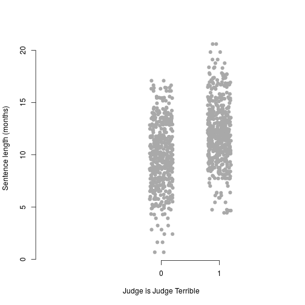
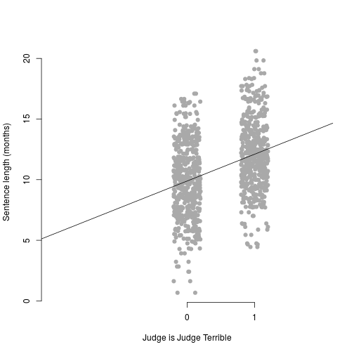
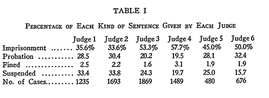

% Judicial behaviour part, 1
% Chris Hanretty
% 6th May 2016


# Introduction

## About this course

 - to make inferences about judges from their behaviour
 - in two parts
   * regression-based methods
   * ideal point analysis
 - Regression based methods will start off with simple scenarios
 
## About me

 - Reader in Politics, University of East Anglia
 - I've published on judicial politics in the UK and elsewhere
 - *I am not a lawyer*
 
## About you

 - I assume no knowledge of statistics
 - You may want to *use* these models
 - I have provided `R` code for you
 - You may want to *understand* these models
 - The code will still help
 
## Outline

 - Random assignment of a single judge to cases, with a continuous outcome
 - Random assignment of a single judge to cases, with a dichotomous outcome
 - Random assignment of multiple judges to cases, dichotomous outcome
 - Random assignment of multiple judges: some complications
 
# Continuous outcomes

## Continuous outcomes in law

 - Continuous outcomes are common
	* Fines (amount of fine in currency)
	* Sentences (length of sentence in months)
	* Damages (damages award)
	* Negligence assessment (% liability)
 - Continuous outcomes are easy to model
 - We use the tools of linear regression
 
## Galton's children


From: Galton, F. (1886). Regression towards mediocrity in hereditary stature. *The Journal of the Anthropological Institute of Great Britain and Ireland*, 15, 246-263.

## A linear regression equation

 - We can summarize the trend by using the equation for a straight line
 
$$
y = a + bx
$$

 - I'll refer to 
	 * $y$ as the dependent variable (in this case children's height)
	 * $x$ as the independent variable (parents' height)
	 * $a$ as an intercept
	 * $b$ as a coefficient
	 
## The best-fitting line


## Interpretation

 - When the value of the independent variable is zero, height is equal to $a$ inches
 - For every unit increase in the independent, height increases by $b$ inches
 - ... other things equal

## Interpretation

 - When the value of the independent variable is zero, height is equal to 39.11 inches
 - For every unit increase in the independent, height increases by 0.4 inches
 - ... other things equal

## For judges

 - Height can be measured by numbers
 - How can judges be measured by numbers?
 - Solution: create dummy variables
 
## An example

 - Suppose cases are heard by two judges: Tender and Terrible
 - We set one of these judges as the *reference category*
 - Suppose *Tender* is the reference category
 - We create a dummy variable which has value zero if Tender heard the case
 - ... and one if *Terrible* heard the case

## Graphing Tender and Terrible



## The best-fitting line





## Interpretation

 - When the value of the independent variable is zero (i.e., Tender heard the case), average sentence length is just under ten months
 - For each unit increase in the variable `terrible`, sentence length increases by 2.2 months
 - Alternatively: Judge Terrible imposes sentences that are 2.2 months longer than Tender.
 - This difference cannot be due to the cases heard by Terrible
 - if Terrible systematically heard cases which required longer sentences, no randomization!

## How does it look? The data


```r
head(tender)
```

```
##      Judge  Sentence JudgeTerrible
## 1 Terrible 16.595639             1
## 2   Tender 13.580389             0
## 3 Terrible 12.178373             1
## 4   Tender  4.746378             0
## 5 Terrible 15.378565             1
## 6   Tender 10.644786             0
```

## How does it look? The command


```r
tender <- read.csv("data/fakedata.csv")
mod <- lm(Sentence ~ JudgeTerrible, data = tender)
```

 - `mod`: an arbitrary name
 - `lm`: short for *l*inear *m*odel
 - `y~x`: dependent variable, then a tilde, then independent variables
 - `data=tender`: tell R where to find our data

## How does it look? The output

\small

```r
summary(mod)
```

```
## 
## Call:
## lm(formula = Sentence ~ JudgeTerrible, data = tender)
## 
## Residuals:
##     Min      1Q  Median      3Q     Max 
## -9.2178 -2.1174 -0.0311  1.9267  8.5047 
## 
## Coefficients:
##               Estimate Std. Error t value Pr(>|t|)    
## (Intercept)     9.8885     0.1343   73.61   <2e-16 ***
## JudgeTerrible   2.2093     0.1900   11.63   <2e-16 ***
## ---
## Signif. codes:  0 '***' 0.001 '**' 0.01 '*' 0.05 '.' 0.1 ' ' 1
## 
## Residual standard error: 3.004 on 998 degrees of freedom
## Multiple R-squared:  0.1193,	Adjusted R-squared:  0.1184 
## F-statistic: 135.2 on 1 and 998 DF,  p-value: < 2.2e-16
```

## How does it look when published?

\small

------------------------------
      &nbsp;           mod    
------------------- ----------
  **(Intercept)**   9.889***\ 
                     (0.134)  

 **JudgeTerrible**  2.209***\ 
                     (0.190)  

       **N**           1000   

      **AIC**         5041.8  

   **R-squared**       0.1    
------------------------------

## Extensions

 - More than two judges: create J-1 dummy variables, where $J$ is the number of unique judges
 - Additional control variables: *not necessary*, but helpful. 
 - Such variables should not change the judge coefficients dramatically
 - Transform our dependent variable by taking the natural log
 - Why? Sometimes our dependent variable is strictly positive.
 
## A model with a logged dependent variable


------------------------------
      &nbsp;           mod    
------------------- ----------
  **(Intercept)**   2.229***\ 
                     (0.015)  

 **JudgeTerrible**  0.233***\ 
                     (0.021)  

       **N**           1000   

      **AIC**         626.5   

   **R-squared**       0.1    
------------------------------

Judge Terrible increases sentences by a *factor* of $e^0.233 = 1.262$. 
Given that average sentence $\sim$ 10 months, this makes sense.
Approximately: coefficient $\times 100$ = the percentage change.


# Dichotomous outcomes

## Examples in law

 - Dichotomous outcomes are also common:
	 * The appeal is either *allowed* or *dismissed*
	 * The plaintiff either *wins* or *loses*
	 * The defendant is either *guilty* or *innocent*
	 * The sentence is either *prison* or a *non-custodial sentence*
	 * (The case is decided in a *liberal* or *conservative* direction)
 - These require a different modelling strategy
 
## A new formula

We need:

 - a formula that models the *probability* of one of two possible outcomes
 - a formula which keeps within logically possible bounds (0-1)
 
Before we had:

$$
y = a + bx
$$

Now we have

$$
Prob(y = 1) = \frac{1}{1 + e^{-(a+bx)}}
$$
 
where $e$ is the exponential operator, or anti-log. 

## Visually...

$a$ = something which makes the outcome more likely when it is higher


## Visually...

$b$ = the degree to which the outcome depends on $x$


## An application

> Gaudet, Frederick, Harris, George S., and St. John, Charles W. (1933), "Individual differences in the sentencing tendencies of judges", *American Institute of Criminal Law and Criminology*, 23(5), 811-818. 

To my knowledge, the earliest use of random assignment of judges to investigate judge effects.

## The logic, explained

> "Since the rule is that there is no selection of the cases which the
judge is to sentence, but that the sentencing of a particular prisoner
by a particular judge is a matter of chance (the judges rotate), it is
obvious that, by chance, each judge should get an equal number of
cases whose sentences would normally be long or short...  Given a
sufficiently large number of cases, if one finds that the average
severity of the sentences of two judges is appreciably different, one
is justified in saying that the factors which determine this
difference in the sentencing tendencies are to be found outside of the
circumstances of the crime and those of the prisoner, and hence
probably in the judge since he is the other factor which is always
present".

## The table



## Running a model

 - My focus is on the decision to imprison
 - I'll assume this is data from a sample, not the entire population
 - Interest is not in the differences, but in their statistical significance

## How it looks: the data


```r
gaudet <- read.csv("data/gaudet.csv")
head(gaudet)
```

```
##     Judge     Sentence
## 1 Judge 1        Other
## 2 Judge 4 Imprisonment
## 3 Judge 2        Other
## 4 Judge 2 Imprisonment
## 5 Judge 1        Other
## 6 Judge 5 Imprisonment
```

## How it looks, the model


```r
mod <- glm(I(Sentence == "Imprisonment")~Judge,
           family = binomial,
           data = gaudet)
```

where 

 - `glm`: short for *g*eneralized *l*inear *m*odel
 - `I(.)`: what follows isn't just a variable name
 - `family = binomial`: this is a logistic regression, not some other model
 
## How it looks, the results

\footnotesize

```r
summary(mod)
```

```
## 
## Call:
## glm(formula = I(Sentence == "Imprisonment") ~ Judge, family = binomial, 
##     data = gaudet)
## 
## Deviance Residuals: 
##     Min       1Q   Median       3Q      Max  
## -1.3116  -1.0935  -0.9051   1.1220   1.4767  
## 
## Coefficients:
##              Estimate Std. Error z value Pr(>|z|)    
## (Intercept)  -0.59157    0.05942  -9.956  < 2e-16 ***
## JudgeJudge 2 -0.08920    0.07860  -1.135 0.256419    
## JudgeJudge 3  0.72338    0.07537   9.598  < 2e-16 ***
## JudgeJudge 4  0.90162    0.07926  11.376  < 2e-16 ***
## JudgeJudge 5  0.39090    0.10931   3.576 0.000349 ***
## JudgeJudge 6  0.59157    0.09720   6.086 1.16e-09 ***
## ---
## Signif. codes:  0 '***' 0.001 '**' 0.01 '*' 0.05 '.' 0.1 ' ' 1
## 
## (Dispersion parameter for binomial family taken to be 1)
## 
##     Null deviance: 10267.4  on 7441  degrees of freedom
## Residual deviance:  9979.7  on 7436  degrees of freedom
## AIC: 9991.7
## 
## Number of Fisher Scoring iterations: 4
```
 
## How it looks, as published


\footnotesize

----------------------------------------
           &nbsp;                mod    
---------------------------- -----------
      **(Intercept)**        -0.592***\ 
                               (0.059)  

 **Judge: Judge 2/Judge 1**   -0.089\   
                               (0.079)  

 **Judge: Judge 3/Judge 1**  0.723***\  
                               (0.075)  

 **Judge: Judge 4/Judge 1**  0.902***\  
                               (0.079)  

 **Judge: Judge 5/Judge 1**  0.391***\  
                               (0.109)  

 **Judge: Judge 6/Judge 1**  0.592***\  
                               (0.097)  

    **Nagelkerke R-sq.**         0.1    

     **Log-likelihood**        -4989.8  

          **AIC**              9991.7   

           **N**                7442    
----------------------------------------

## Interpretation

 - The coefficient on Judge 3 is 0.723
 - This means that Judge 3 is $e^{0.723} = 2.061$ times more likely to send people to prison.
 - That makes sense given the figures listed in Gaudet et al's Table 1.
 
# Multiple judges

## Our new source of data


## The dependent variable

 - The vote of an individual judge in a case heard by multiple judges
  - These votes can be coded in different ways
  - Here, the focus is on "stereotypically liberal" decisions
  
## The independent variable

 - A dummy variable, which has value one if the judge was appointed by a Democratic president
 - In the book, this is elided with ideology
 - "Party of the appointing actor" may be a poor guide in other contexts
 
## The key assumption

 - For the book to work, it's necessary for judges to be assigned to cases on a random basis
 - *Within each circuit*, judges are assigned randomly
 - So *within a circuit*, we can just use judge dummies
 
## A simple example

 - Let's focus on cases:
	 * involving the Americans with Disabilities Act
	 * in the 7th Circuit
 - Why? Most common circuit-casetype combination

### The data


```
##                judge_name conserve_vote         cite dec_year party_pres
## 138        Flaum, Joel M.             0 269 F.3d 831     2001          0
## 165     Kanne, Michael S.             1 213 F.3d 365     2000          0
## 181    Ripple, Kenneth F.             0 269 F.3d 831     2001          0
## 222    Eschbach, Jesse E.             1 207 F.3d 945     2000          0
## 235 Easterbrook, Frank H.             1 213 F.3d 365     2000          0
## 236 Easterbrook, Frank H.             1 207 F.3d 945     2000          0
```

## A simple model

\footnotesize


```r
mod <- glm(conserve_vote~party_pres,
           data = ada,
           family = binomial)
summary(mod)
```

```
## 
## Call:
## glm(formula = conserve_vote ~ party_pres, family = binomial, 
##     data = ada)
## 
## Deviance Residuals: 
##     Min       1Q   Median       3Q      Max  
## -1.7268   0.7143   0.7143   0.7143   0.8530  
## 
## Coefficients:
##             Estimate Std. Error z value Pr(>|z|)    
## (Intercept)   1.2359     0.1295   9.547   <2e-16 ***
## party_pres   -0.4122     0.2241  -1.839   0.0659 .  
## ---
## Signif. codes:  0 '***' 0.001 '**' 0.01 '*' 0.05 '.' 0.1 ' ' 1
## 
## (Dispersion parameter for binomial family taken to be 1)
## 
##     Null deviance: 541.56  on 482  degrees of freedom
## Residual deviance: 538.24  on 481  degrees of freedom
## AIC: 542.24
## 
## Number of Fisher Scoring iterations: 4
```

## Multiple circuits

 - Here, we have results that are not significant at commonly-accepted levels
 - We have additional data we can use -- data from other circuits
 - However, judges are not randomly-assigned to cases *across circuits*
 - In particular, the chances of a Democrat sitting on certain cases is higher on certain circuits
 
## Testing random assignment *across* circuits

 - Let's model `party_pres` as a function of circuit!
 


```r
mod <- glm(party_pres ~ factor(circuit),
           data = dat,
           family = binomial)
```

## The "reverse" model

\scriptsize

```
## 
## Call:
## glm(formula = party_pres ~ factor(circuit), family = binomial, 
##     data = dat)
## 
## Deviance Residuals: 
##     Min       1Q   Median       3Q      Max  
## -1.3790  -0.9420  -0.7846   1.3005   1.6299  
## 
## Coefficients:
##                   Estimate Std. Error z value Pr(>|z|)    
## (Intercept)       -0.63777    0.07174  -8.890  < 2e-16 ***
## factor(circuit)2   0.83478    0.09485   8.801  < 2e-16 ***
## factor(circuit)3   0.05505    0.11059   0.498 0.618655    
## factor(circuit)4   0.26836    0.10649   2.520 0.011738 *  
## factor(circuit)5  -0.14806    0.09470  -1.564 0.117927    
## factor(circuit)6   0.69524    0.09349   7.437 1.03e-13 ***
## factor(circuit)7  -0.38275    0.08530  -4.487 7.21e-06 ***
## factor(circuit)8  -0.21268    0.08601  -2.473 0.013408 *  
## factor(circuit)9   1.10016    0.09250  11.894  < 2e-16 ***
## factor(circuit)10  0.35299    0.09598   3.678 0.000235 ***
## factor(circuit)11  0.15504    0.09811   1.580 0.114061    
## factor(circuit)12  0.23834    0.10573   2.254 0.024175 *  
## ---
## Signif. codes:  0 '***' 0.001 '**' 0.01 '*' 0.05 '.' 0.1 ' ' 1
## 
## (Dispersion parameter for binomial family taken to be 1)
## 
##     Null deviance: 18619  on 13927  degrees of freedom
## Residual deviance: 17897  on 13916  degrees of freedom
## AIC: 17921
## 
## Number of Fisher Scoring iterations: 4
```

## How to proceed?

 - We have seen the chances of a Democrat sitting on a case varies according to circuit
 - Differences in the rates at which Democrats vote certain ways may therefore be due not to party...
 - but to the types of circuits which Democrats sit on, and the types of cases heard by those circuits
 - ... but if we were prepared to say that the chance of a Democrat was random *conditional* on knowing the circuit?
 
## A fuller model


```r
mod <- glm(conserve_vote~party_pres+factor(circuit),
           data = dat,
           family = binomial)
```

## The fuller model, results

\tiny

```r
summary(mod)
```

```
## 
## Call:
## glm(formula = conserve_vote ~ party_pres + factor(circuit), family = binomial, 
##     data = dat)
## 
## Deviance Residuals: 
##     Min       1Q   Median       3Q      Max  
## -1.5312  -1.2387   0.8609   1.0497   1.4793  
## 
## Coefficients:
##                   Estimate Std. Error z value Pr(>|z|)    
## (Intercept)        0.36547    0.07019   5.207 1.92e-07 ***
## party_pres        -0.45017    0.03638 -12.373  < 2e-16 ***
## factor(circuit)2  -0.22262    0.09328  -2.387  0.01700 *  
## factor(circuit)3  -0.53767    0.10748  -5.003 5.66e-07 ***
## factor(circuit)4   0.07786    0.10458   0.744  0.45660    
## factor(circuit)5   0.28194    0.09109   3.095  0.00197 ** 
## factor(circuit)6  -0.05747    0.09187  -0.626  0.53158    
## factor(circuit)7   0.43612    0.08148   5.352 8.68e-08 ***
## factor(circuit)8   0.38977    0.08281   4.707 2.52e-06 ***
## factor(circuit)9  -0.60184    0.09122  -6.598 4.17e-11 ***
## factor(circuit)10 -0.16039    0.09382  -1.709  0.08737 .  
## factor(circuit)11  0.15153    0.09575   1.583  0.11353    
## factor(circuit)12 -0.21445    0.10312  -2.080  0.03755 *  
## ---
## Signif. codes:  0 '***' 0.001 '**' 0.01 '*' 0.05 '.' 0.1 ' ' 1
## 
## (Dispersion parameter for binomial family taken to be 1)
## 
##     Null deviance: 19105  on 13918  degrees of freedom
## Residual deviance: 18471  on 13906  degrees of freedom
##   (9 observations deleted due to missingness)
## AIC: 18497
## 
## Number of Fisher Scoring iterations: 4
```

## Problems with the analysis in Sunstein et al.

 - Random allocation isn't true even within circuits!
 - For information on this, see:
 
> Hall, M. (2010). Randomness Reconsidered: Modeling Random Judicial Assignment in the US Courts of Appeals. *Journal of Empirical Legal Studies*, 7(3), 574-589.

 - Hall called the clerks in each circuit
 - He found that "[r]andom assignment was not used in the Fourth Circuit before the year 2000,the Fifth and Eighth Circuits before 2003, or the Tenth Circuit before 1998"
 - He also noted that partisan composition *of circuits* changes over time
 - When corrected for these oversights, the magnitude of the effect changes.
 - Always check the veracity of any random allocation assumption!
 

# Panel outcomes

## A further problem with Sunstein

 - Often, the idea of random assignment is bound up with the idea of a randomized controlled trial
 - In this context, experimental *subjects* are assigned to a treatment or control *condition*
 - Subsequent properties of the subjects are measured.
 - In Sunstein et al, cases are assign to a treatment (Democratic judge) or control (Republican judge)
 - ... but they receive other treatments (the other two judges on the panel)
 - and the outcome is measured at the level of the treatment (the judge), not the case!
 
## Explaining panel outcomes

 - Ideally, we'd like a way of explaining the effect of judges on panel outcomes
 - This is problematic, because it requires a theory of panel decision-making
 - Suppose the median voter decides, and we assign a third judge to an existing panel:
	 * If the two judges are RR, the median judge is R. Adding another R or D makes no difference
	 * If the two judges are DD, the median judge is D; the same reasoning follows
	 * If the two judges are RD or DR, adding another D or R will determine the median judge
 - Only in the last case does the judge matter
 - If we ran a regression, and if all circumstances were equally probably, our estimate would be biased downwards
 
## Options

 - Option 1 (low-tech): split the data up according to the partisanship of the first two judges:
	 * Pro: Easy to implement
	 * Pro: Recovers coefficients which link to the outcome
	 * Con: We're left with three effects
	 * Con: It's essential atheoretical
 - Option 2 (high-tech): posit a latent ideology associated with each judge, and take the median
	 * Pro: matches theory
	 * Pro: recovers a single estimate
	 * Con: requires some difficult-to-implement Bayesian statistics
	 
## Modelling panel outcomes

For more information on this type of approach, see:

Hangartner, Dominik, Benjamin E. Lauderdale, and Judith Spirig. "Refugee Roulette Revisited: Judicial Preference Variation and Aggregation on the Swiss Federal Administrative Court 2007-2012." (Working paper).

# Conclusions

## General

 - We've been able to exploit random assignment to learn something about judges
 - Given (limited, predictable) non-random assignment, we've been able to control for that, and still learn
 - We haven't discussed strongly non-random assignment (on the basis of experience, or other factors).

## Data

 - All the data is available on GitHub
 - The url is TODO:
 - The R code is also there
 - The Sunstein data is in any case available at [http://epstein.wustl.edu/research/behaviorJudges/chapters.php?req=11](http://epstein.wustl.edu/research/behaviorJudges/chapters.php?req=11)


