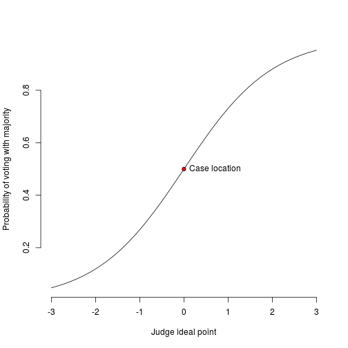
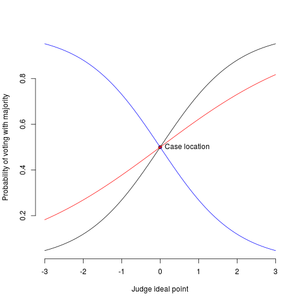
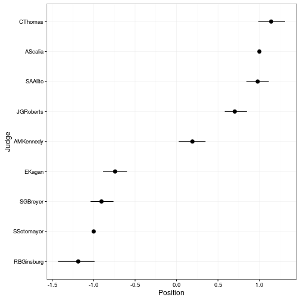

% Judicial behaviour, part 2
% Chris Hanretty
% 6th May 2016


# Ideal point analysis

## The key idea

 - Before, we looked at variation across cases
 - We needed random assignment to exclude differences in outcome resulting from differences in cases
 - There is also variation *within* cases
 - That is, judges can dissent, and this can permit inferences about their ideology
 
## Not universally applicable

 - Not every court allows (signed) dissenting opinions
 - In such cases, these models can't apply
 - But see Malecki, M. (2012). Do ECJ judges all speak with the same voice? Evidence of divergent preferences from the judgments of chambers. *Journal of European Public Policy*, 19(1), 59-75.
 
## Start simple

 - I'll be using the most common database of judicial behaviour,the Spaeth database
 - You can find it at [scdb.wustl.edu](scdb.wustl.edu)
 - The database is in a *long* format (one row = one judge/case)
 - You will need to convert it to a *wide* format
 


## The first few lines of Spaeth

\tiny

----------------------------------------------------------------------
 &nbsp;   caseId   AMKennedy   AScalia   CThomas   EKagan   JGRoberts 
-------- -------- ----------- --------- --------- -------- -----------
 **7**   2010-007      1          0         1        1          1     

 **15**  2010-015      1          1         1        1          1     

 **16**  2010-016      1          1         0        1          1     

 **19**  2010-019      1          0         1        1          1     
----------------------------------------------------------------------

Table: Table continues below

 
-------------------------------------------------------
 &nbsp;   RBGinsburg   SAAlito   SGBreyer   SSotomayor 
-------- ------------ --------- ---------- ------------
 **7**        1           1         1           1      

 **15**       0           1         1           0      

 **16**       0           1         1           1      

 **19**       0           1         1           1      
-------------------------------------------------------

By convention, '1' = a vote with the majority.

## Simple measures


 - The average rate at which judges agree is 75 percent
 - The lowest rate of agreement between two judges is 59 percent
 - This is between RBGinsburg and CThomas.
 - Is this rate significantly lower than average?
 
## Simple tests for simple measures

\small


```r
times.judges.agreed <- 228
times.judges.sat.together <- 387
binom.test(times.judges.agreed,
           times.judges.sat.together,
           p = 0.75)
```

```
## 
## 	Exact binomial test
## 
## data:  times.judges.agreed and times.judges.sat.together
## number of successes = 228, number of trials = 387, p-value =
## 5.261e-12
## alternative hypothesis: true probability of success is not equal to 0.75
## 95 percent confidence interval:
##  0.5383110 0.6386093
## sample estimates:
## probability of success 
##              0.5891473
```

## A UK counterexample

 - Dissent is less common on the UK Supreme Court...
 - but judges are often seen as 'small-c conservative' or not
 - one interesting judge pairing: Lady Hale and Lord Sumption
 - Do they also agree at below average rates?
 
## Hale/Sumption


```r
times.judges.agreed <- 21
times.judges.sat.together <- 26
binom.test(times.judges.agreed,
           times.judges.sat.together,
           p = 0.84)
```

```
## 
## 	Exact binomial test
## 
## data:  times.judges.agreed and times.judges.sat.together
## number of successes = 21, number of trials = 26, p-value = 0.5954
## alternative hypothesis: true probability of success is not equal to 0.84
## 95 percent confidence interval:
##  0.6064945 0.9344519
## sample estimates:
## probability of success 
##              0.8076923
```

Lesson of the tale? Before you get advanced, get simple.

## Why can't we proceed in this way?

 - We could calculate pairwise rates of agreement
 - We could arrange judges by similarity
 - But the number of comparisons grows exponentially:
	 * Three-judge court: 3 comparisons
	 * Five-judge court: 10 comparisons
	 * Nine-judge court: 36 comparisons
 - We need something that makes differences between judges stand out
 
## Notation

 - I'll use $j$ to refer to judges 1 through $J$ 
 - I'll use $i$ to refer to cases 1 through $I$
 - Each judge is assumed to have an ideal point, $\theta_j$ (theta-j)
 - That's a point in a (one-dimensional) space
 - Often, smaller numbers = more left-wing
 
## More notation

 - Each case will have a *location* or a *cutpoint*
 - I'll denote this using $\alpha_i$
 - This is defined relative to judges' votes
 - The cutpoint is supposed to divide judges who vote one way from judges who vote another way
 
## The outcome

 - Here, we'll be trying to explain the judge's vote
 - I'll use $y_{ij}$ to refer to that 
 - By convention, $y_{ij}=1$ when the judge votes with the majority
 - For the moment, let's assume the majority is always conservative
 
## The relationship, visually



## The relationship, in equations

$$
p = \frac{1}{1 + e^{-a + bx}}
$$

I'm going to replace two of the letters in that equation by the specialised terms we used before, and scrub out the b. 

$$
p = \frac{1}{1 + e^{-\alpha_i + \theta_j}}
$$

Alternately,

$$
p = \frac{1}{1 + e^{\theta_j-\alpha_i}}
$$

## The problem

 - Not all cases can be guaranteed to be related to ideology in the same way
 - The relationship might be weaker (the slope of the curve might be flatter)
 - The relationship might go the other way
 - To cope with this, we'll introduce a *case discrimination parameter*, $\beta$


## Varying discrimination parameters



## The task

> "Dear computer, Please find values of $\alpha$, $\beta$, and
> $\theta$ that best make sense of the pattern of votes we see. Yours,
> Chris"

 - Estimation is through Markov Chain Monte Carlo.
 - Take some starting estimates ('guesses') of the values
 - Jump around a bit, and if the fit got better, keep those values
 - Repeat until you're fairly sure the values you have don't depend on your starting values

## Making it easier

 - We can get rid of all unanimous cases
 - These cases contribute nothing to our knowledge of the parameters
 - The case location parameter could be either far to the left, or far to the right
 - It's impossible to tell
 
## One problem

 - As it stands, our model is not *identified*
 - (That is, we cannot uniquely identify good values)
 - Multiply everything by minus 1, flipping it around? No change
 - Scale everything by dividing it by a constant? No change
 
## Identification constraints

 - Common to fix two judges as 'anchor' judges
 - set, e.g., a left-wing judge to -1, a right-wing judge to +1
 - Sets both scale and direction
 
## Implementation

 - Two common packages:
	 * `MCMCpack`, and its function `MCMCirt1d`
	 * `pscl` and its function `ideal`
 - I would probably recommend `pscl`
 - Both packages require data with judges down the rows
 
## Prepping the data


```r
### Get the third column to the last column
vote.mat <- scdb.c[,3:ncol(scdb.c)]
### Store the judge names
judge.names <- names(vote.mat)
### Convert the data to a matrix
vote.mat <- as.matrix(vote.mat)
### Transpose it
vote.mat <- t(vote.mat)
### Show the first three judges and
### the first ten cases
vote.mat[1:3,1:10]
```

## In `MCMCpack`

\footnotesize 


```r
library(MCMCpack)
### Test run
model <- MCMCirt1d(vote.mat,
                  theta.constraints = list("AScalia" = 1,
                                           "SSotomayor" = -1),
                  burnin=50,
                  mcmc=100,
                  thin=2,
                  verbose=5,
                        store.item=TRUE)
```

## In `pscl`

\footnotesize 


```r
library(pscl)
my.rc <- rollcall(vote.mat,
                  legis.names = judge.names)
my.rc <- dropUnanimous(my.rc)
cl <- constrain.legis(my.rc,
                            x=list("AScalia"=1,
                              "SSotomayor"=-1),
                            d=1)
model <- ideal(my.rc, d = 1,
               maxiter = 100,
               burnin = 50,
               thin = 2,
               priors = cl,
               startvals = cl,
               store.item = TRUE)               
```

## What do the results look like?




## How good is the model?

 - Has the model converged? 
 - Does it make sense?
	 * Do the judges line up in accordance with your priors?
	 * Is there a correlation between judge position and appointing party position?
	 * Do cases with large positive $b$ result in "conservative" outcomes?
 - Does it fit the data well?
	 * How many votes does it correctly predict?
	 * How does this compare to the null model (everyone votes with the majority with probability $p$)
 
## Extensions

 - What if judges made decisions in two dimensions?
	 * Possible, but tricky
	 * Data often not informative enough
	 * "Informative voting" (of the kind we see in legislatures) often one-dimensional
 - What if we had extra information about judges (cases)?
	 * Very possible: see `MCMirtHier1d`

## Conclusions

 - Ideal point analysis is a form of description or data summary
 - It has a theory embedded within it
 - There are extensions which look at the cost of dissenting, or legal dimensions
 - ... but these are phenomenally complex:
	 * Iaryczower, M., & Shum, M. (2012). The value of information in the court: Get it right, keep it tight. *The American Economic Review*, 102(1), 202-237.
	 * Weinshall Margel, K., Sommer, U, and Ritov, Y., (2016) Decision Making in High Courts: The Dynamic Comparative Attitudinal Measure. *Working paper*. 
